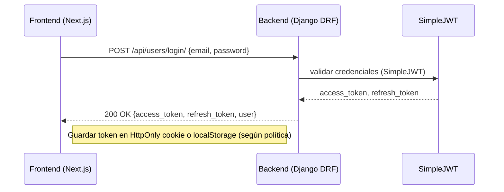
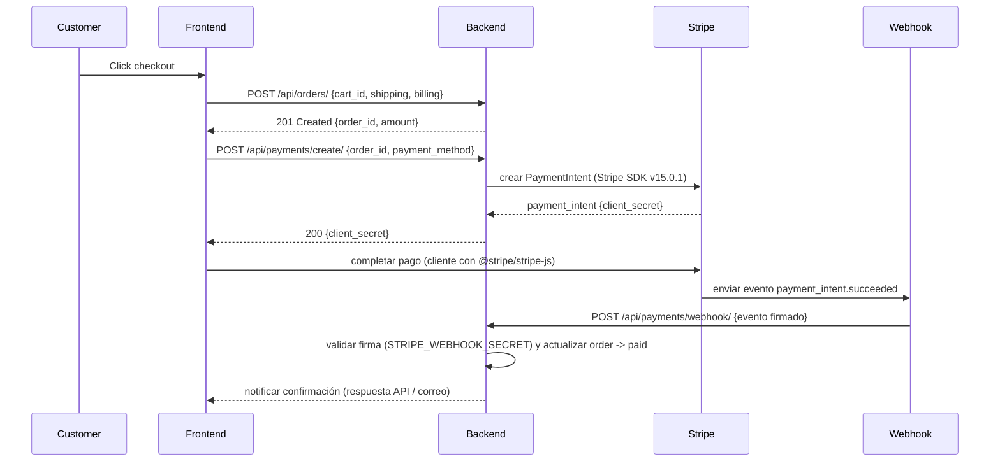
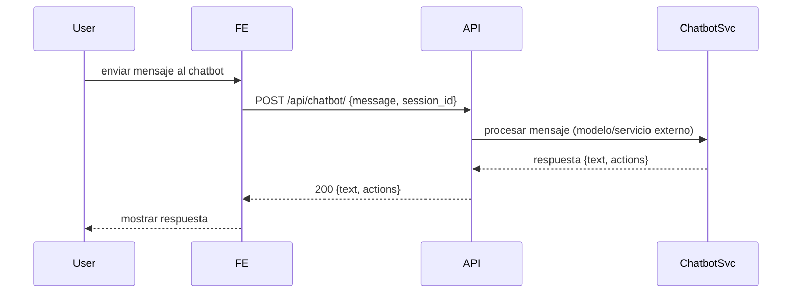
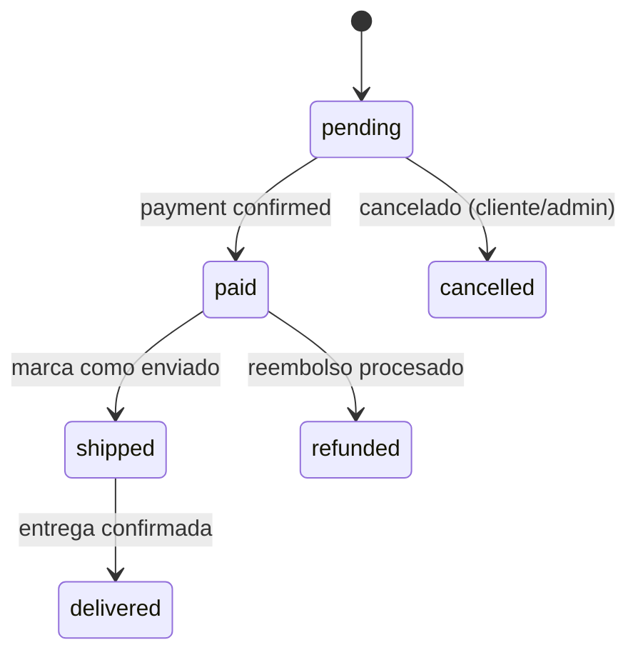
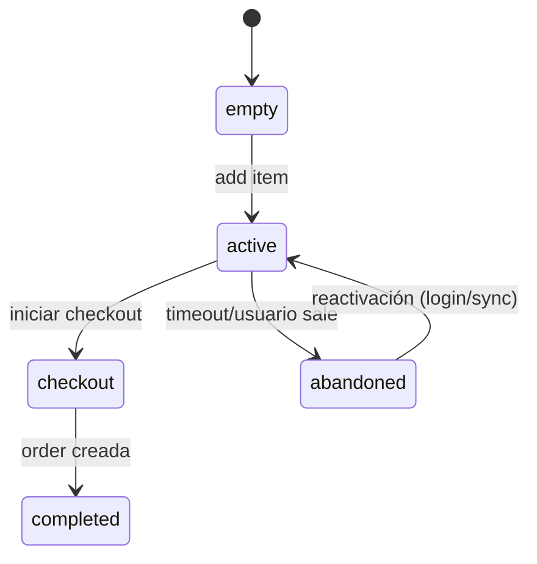

# ANÁLISIS DEL SOFTWARE — Vistas Dinámicas

Este documento contiene diagramas dinámicos que describen los flujos principales del sistema Urban Store: login con JWT, flujo completo de compra, interacciones del chatbot, procesos de registro y pago, y diagramas de estados para Orders y Cart. Todos los diagramas están en Mermaid.

## 1. Secuencia: Login con JWT


## 2. Secuencia: Flujo completo de compra (carrito → checkout → Stripe → confirmación pedido)


## 3. Secuencia: Chatbot request/response


## 4. Actividad: Proceso de registro de usuario
```mermaid
flowchart TD
    A[Inicio: formulario registro] --> B{Validar datos}
    B -->|Ok| C[Crear usuario en MongoDB via mongoengine]
    C --> D[Generar tokens JWT (SimpleJWT)]
    D --> E[Enviar email verificación (EMAIL_HOST)]
    E --> F[Redirigir a dashboard o login]
    B -->|Error| G[Mostrar errores]
```

## 5. Actividad: Proceso de pago con Stripe + webhook
```mermaid
flowchart TD
    A[Cliente inicia pago] --> B[Backend crea PaymentIntent]
    B --> C[Backend devuelve client_secret al Frontend]
    C --> D[Frontend completa pago con Stripe Elements]
    D --> E[Stripe procesa pago]
    E --> F[Stripe envía webhook a /api/payments/webhook/]
    F --> G[Backend valida firma y estado del evento]
    G --> H[Backend actualiza Order.status -> paid]
    H --> I[Emitir señal (Django signals) para analytics y notificaciones]
```

## 6. Diagrama de estados: Ciclo de vida de un Order


## 7. Diagrama de estados: Ciclo de vida del Cart


---
Urban Store — Análisis de Software (vistas dinámicas). <!-- TODO: agregar tiempos de respuesta esperados y métricas de carga -->
