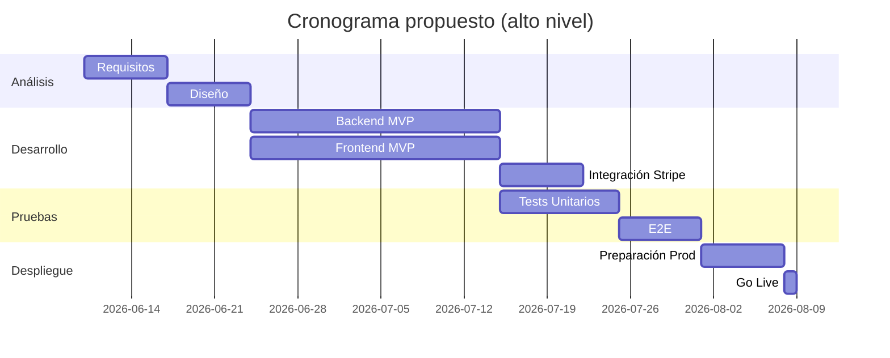

# PROPUESTA TÉCNICA

## Resumen ejecutivo
Urban Store es una solución de comercio electrónico para streetwear que combina un frontend moderno (Next.js) y un backend robusto (Django + DRF) con persistencia en MongoDB y soporte para pagos mediante Stripe. Esta propuesta técnica justifica las decisiones tecnológicas y describe el plan de trabajo para entrega de un MVP escalable y mantenible.

## Planteamiento del problema
El mercado de streetwear en Colombia necesita una plataforma rápida, segura y orientada a móviles que permita a pequeñas marcas publicar catálogos, gestionar inventario y procesar pagos con seguridad, además de ofrecer recomendaciones para aumentar conversión.

## Solución propuesta
- Frontend React/Next.js (App Router) para rendimiento y SEO.
- Backend Django + DRF para API modular, con mongoengine para catálogo flexible.
- Integración con Stripe para pagos y Cloudinary para gestión de media.
- Contenerización con Docker y orquestación local con docker-compose.

## Justificación tecnológica
| Tecnología | Versión | Por qué se eligió |
|---|---:|---|
| Django | 6.0.3 | Framework maduro, admin integrado y buena integración con DRF.
| Django REST Framework | 3.16.1 | Serializers y viewsets que facilitan la creación de APIs.
| MongoDB | 7 + mongoengine 0.29.3 | Modelo documental flexible para catálogo de productos.
| Next.js | 16.2.3 | Rendimiento, SSR/SSG y App Router moderno.
| Stripe | 15.0.1 | Pasarela segura y ampliamente adoptada.
| Cloudinary | 1.44.1 | CDN y optimización de imágenes.

Comparativa (resumen):
- Django vs Flask: Django proporciona más funcionalidades out‑of‑the‑box (admin, ORM/gestión) que aceleran la entrega, preferible para MVP académico. 
- Next.js vs CRA: Next.js ofrece SSR/SSG para SEO y rendimiento. 
- MongoDB vs PostgreSQL: MongoDB facilita esquemas flexibles para catálogo; PostgreSQL es opción para datos relacionales y transacciones (opcional en producción).

## Enfoque arquitectónico
Monolito modular: separación clara entre frontend (Next.js) y backend (Django/DRF). El backend expone endpoints REST protegidos con JWT. Persistencia primaria en MongoDB para productos; opción PostgreSQL incluida en dependencias para migraciones transaccionales.

## Metodología y roles
- Metodología: Scrum con sprints de 2 semanas.
- Roles recomendados:
  - Product Owner (PO)
  - Scrum Master
  - 2 Developers backend
  - 2 Developers frontend
  - QA
  - DevOps (1) para despliegue y CI/CD

## Matriz de riesgos
| Riesgo | Probabilidad | Impacto | Mitigación |
|---|---:|---:|---|
| Integración Stripe falla | Media | Alto | Entorno de pruebas, pruebas con webhooks firmados
| Conexión a MongoDB en producción | Baja | Alto | Plan de réplica, monitorización y back ups
| Exposición de secretos en repo | Media | Alto | .env en .gitignore, gestor de secretos en producción

## Análisis de factibilidad
- Técnica: Alta — tecnologías maduras en el stack.
- Operativa: Media — requiere configuración de infra y secret management.
- Económica: <!-- TODO: agregar estimación de costos de hosting, Stripe fees y CDN -->

---
Propusta técnica generada a partir del contexto del proyecto Urban Store.